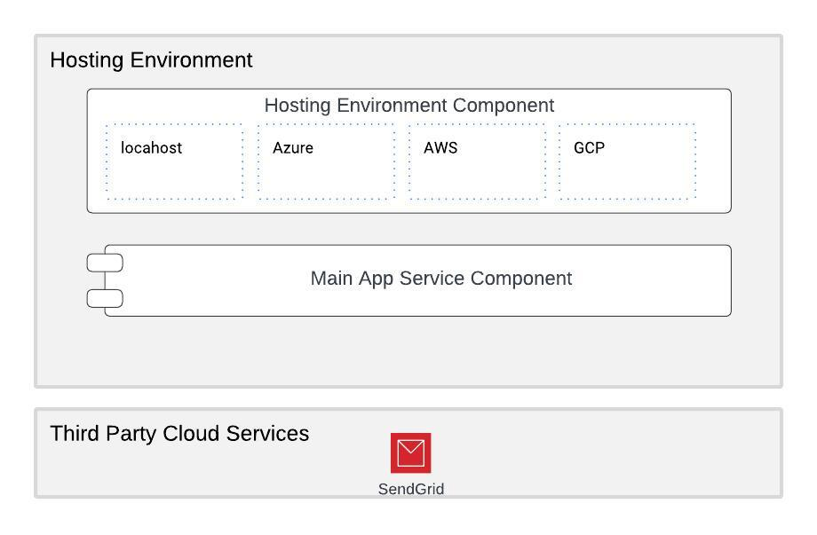
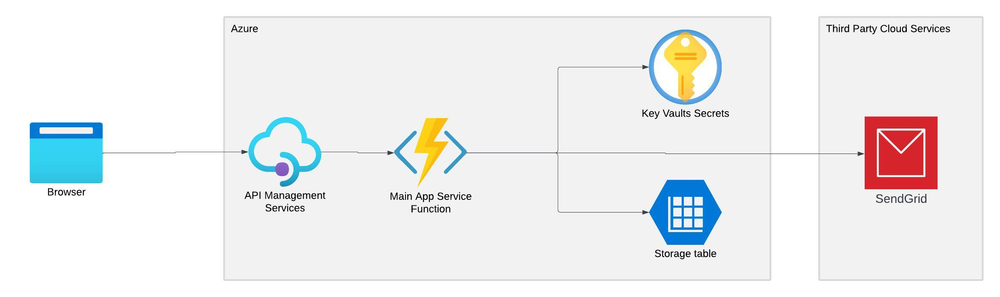

# DEMO App Architecture

Drawing from the insights presented in the "General Guide: Architectural Insights," the DEMO app is thoughtfully designed as an environment-agnostic service. While currently anchored by a central core component, the Main Service, the architecture is primed for future expansion. This flexibility allows for the seamless integration of additional components as the app's functionality evolves.

Harnessing the power of environment-specific settings, our deployment process orchestrates the generation and assembly of environment-specific code. Although the current iteration of the code seamlessly adapts to both localhost and Azure environments, the underlying approach lays the foundation for embracing a broader array of environments in the times ahead.

To illustrate, in the context of the Azure environment, our deployment mechanism crafts specialized Azure Function code, intricately meshing with the versatile Main Service component. This adaptive architectural approach ensures the app's resilience and adaptability, regardless of the hosting environment, embodying a forward-thinking philosophy that anticipates future growth and innovation.
## Azure

After deploying to the Azure environment, the architecture will resemble the following:

In this specific scenario, placing an API Gateway in front of a single Function might not seem necessary. However, its presence serves as a demonstration and emphasizes that the architecture can accommodate multiple Function services in our solution. This setup demonstrates the app's readiness for such changes. Furthermore, removing the API Gateway component during the build process would be a straightforward adjustment.

## localhost

