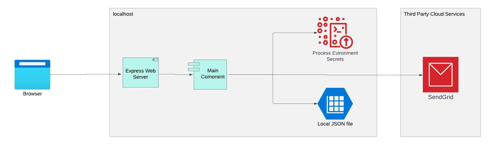

[home](../README.md)
[installation](./3-installation.md)
# DEMO App Architecture

Drawing from the insights presented in the ["General Guide: Architectural Insights"](./1-Architecture.md) the DEMO app is thoughtfully designed as an environment-agnostic service. While currently anchored by a central core component, the Main Service, the architecture is primed for future expansion. This flexibility allows for the seamless integration of additional components as the app's functionality evolves.

Harnessing the power of environment-specific settings, our deployment process orchestrates the generation and assembly of environment-specific code. Although the current iteration of the code seamlessly adapts to both localhost and Azure environments, the underlying approach lays the foundation for embracing a broader array of environments in the times ahead.

To illustrate, in the context of the Azure environment, our deployment mechanism crafts specialized Azure Function code, intricately meshing with the versatile Main Service component. This adaptive architectural approach ensures the app's resilience and adaptability, regardless of the hosting environment, embodying a forward-thinking philosophy that anticipates future growth and innovation.
## Azure

After deploying to the Azure environment, the architecture will resemble the following:

In this specific scenario, placing an API Gateway in front of a single Function might not seem necessary. However, its presence serves as a demonstration and emphasizes that the architecture can accommodate multiple Function services in our solution. This setup demonstrates the app's readiness for such changes. Furthermore, removing the API Gateway component during the build process would be a straightforward adjustment.

It's worth noting that the [Live Demo Link](https://a488secureappdemofnappmain.azurewebsites.net/api/main ) showcases that a direct link to the function itself works equally well, underlining the app's adaptability and versatility.

## localhost

 

It's worth noting that in the localhost case and Azure case, the Secrets Services and DB Services differ. Azure leverages Key Vault for secrets and uses Storage Table for the database. Conversely, in the localhost environment, environment variables and a local JSON file are employed for secrets and the database, respectively. Importantly, the actual code in our main component service remains the same. The magic of differentiation is orchestrated by the environment-specific code, which is both adaptable and easily adjustable for each environment.

# Code Organization

## Core/Domain Logic
Our project's core services are organized within the `/services` folder. Each subfolder in this directory represents an independent service, which transforms into an Azure Function upon deployment. Currently, our primary service is named "main," encompassing the core application logic.

The entry point for our service is `http_router.js`. This module takes an HTTP request as input and generates an HTTP response object. It serves as the orchestrator between the HTTP layer and the core application logic.

Additionally, the `/routes` subfolder handles route registration. Depending on the incoming HTTP request, the corresponding route file is loaded, and each route executes its specific logic.

In the context of the "main" service, all routes collaborate with the `../security/users.js` file, executing operations provided by this component. The Users component interfaces with `Users-repo.js` to store and retrieve data. The `users-repo` component determines the type of database to be used (e.g., KeyValueStore, SQL, Document). Ultimately, the users-repo interacts with the environment's concrete database for data storage and retrieval.

Furthermore, the `/html` subfolder contains HTML files that certain routes can serve, responding to specific HTTP requests.

## Environment-Specific Code

The `/env` folder hosts code tailored to various environments. During the deployment process, this code constructs the necessary cloud environment structure and provisions resources for deploying the application code. In the case of the localhost environment, the core services' `http_router` module is directly utilized without any additional cloud-specific setup.
